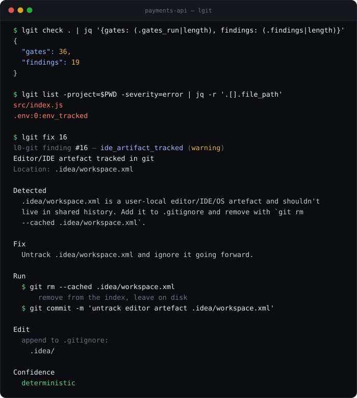
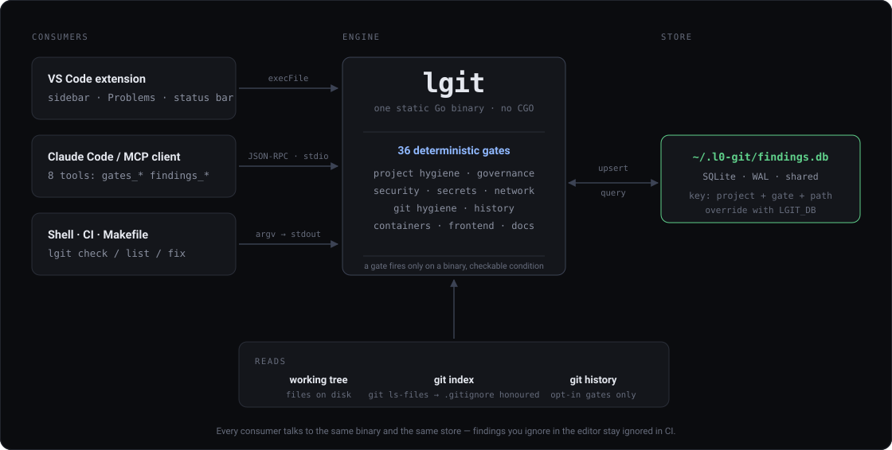

<p align="center">
  
</p>

<p align="center">
  <a href="https://github.com/fabriziosalmi/l0-git/actions/workflows/ci.yml"></a>
  <a href="https://github.com/fabriziosalmi/l0-git/releases"></a>
  <a href="server/go.mod"></a>
  <a href="LICENSE"></a>
  <a href="https://fabriziosalmi.github.io/l0-git/"></a>
</p>

l0-git checks a repository for the things that are simply true or false about
it — a missing license, a tracked `.env`, a `FROM node:latest`, an unresolved
merge marker — and keeps the answers in one store that your shell, your editor
and your coding agent all read from.

One Go binary. No CGO, no Python, no rule engine, no YAML DSL.

**📖 [Full documentation](https://fabriziosalmi.github.io/l0-git/)** ·
[Gate reference](https://fabriziosalmi.github.io/l0-git/gates/) ·
[Getting started](https://fabriziosalmi.github.io/l0-git/guide/getting-started)

---

## See it work



`lgit check` runs the gates and persists what it found. `lgit list` queries it.
`lgit fix` explains one finding — and for the eight gates with deterministic
recipes, hands you the exact commands instead of a paragraph of advice.

## Install

```sh
OS=$(uname -s | tr '[:upper:]' '[:lower:]')
ARCH=$(uname -m); [ "$ARCH" = x86_64 ] && ARCH=amd64; [ "$ARCH" = aarch64 ] && ARCH=arm64

curl -fsSL "https://github.com/fabriziosalmi/l0-git/releases/latest/download/lgit-$OS-$ARCH.tar.gz" | tar xz
sudo mv "lgit-$OS-$ARCH" /usr/local/bin/lgit
```

Binaries are published for linux, darwin and windows × amd64 and arm64. From
source: `make build` (needs Go, version pinned in [`server/go.mod`](server/go.mod)).

## Quick start

```sh
lgit check .                              # run every gate, persist findings
lgit list -project=$PWD -severity=error   # just the things that matter now
lgit fix <id>                             # what to do about one of them
```

Everything prints JSON on stdout, so it pipes into `jq` and into CI. The one
exception is `lgit fix`, which prints for humans unless you pass `--json`.

See the [CLI reference](https://fabriziosalmi.github.io/l0-git/cli/) for every
subcommand and flag.

## What it checks

35 gates. Follow a link for what each one actually looks at, its options, and
how to silence it.

| Theme | Gates |
|---|---|
| [Project hygiene](https://fabriziosalmi.github.io/l0-git/gates/#project-hygiene) | README, LICENSE, CONTRIBUTING, SECURITY, CHANGELOG, CODE_OF_CONDUCT, PR and issue templates, CI workflow |
| [Governance](https://fabriziosalmi.github.io/l0-git/gates/#governance) | CODEOWNERS, branch protection declared as code |
| [Git hygiene](https://fabriziosalmi.github.io/l0-git/gates/#git-hygiene) | `.gitignore` presence and coverage, merge markers, large files, vendored dirs, IDE artefacts, executable bits, filename quality |
| [Security](https://fabriziosalmi.github.io/l0-git/gates/#security) | Secrets scan, connection strings, network literals |
| [Git history](https://fabriziosalmi.github.io/l0-git/gates/#git-history-opt-in) | Secrets and large blobs still in `.git` (opt-in) |
| [Containers](https://fabriziosalmi.github.io/l0-git/gates/#containers) | Dockerfile lint, Compose lint |
| [Frontend](https://fabriziosalmi.github.io/l0-git/gates/#frontend-accessibility) | HTML accessibility lint, CSS lint |
| [Documentation](https://fabriziosalmi.github.io/l0-git/gates/#documentation) | Markdown lint, dead placeholders, uncommented `.env.example` keys |
| [Quality & release](https://fabriziosalmi.github.io/l0-git/gates/#quality-release) | Tests present, config parse errors, version drift, `.nvmrc` |

## The rule that decides what gets in

> A gate fires if and only if the violation can be expressed as a binary,
> mathematically unambiguous condition over the file system, the git index, or
> a parse tree.

That constraint buys reproducibility: the same tree gives the same findings on
any machine, with no model, no network and no threshold to tune.

It does **not** buy being right about intent. A gate can be perfectly
deterministic about the bytes and still wrong about what they mean — a mock AWS
key in a fixture, a `0.0.0.0` bind that is the only correct choice inside a
container, a `docker.sock` mount in the service whose whole job is talking to
Docker. The current defaults come out of an adversarial sweep against 220 real
repositories, and several categories ship off by default for exactly this
reason.

Anything that needs genuine context understanding is deliberately not a gate.
It goes down the remediation path, where being wrong costs a suggestion rather
than a red build.

## How the pieces fit



Three front ends, one binary, one SQLite file. That is why a finding you ignore
in the editor stays ignored when CI runs.

## Use with Claude Code

```sh
make install-mcp     # claude mcp add l0-git $(pwd)/server/lgit mcp
```

`lgit mcp` speaks MCP over stdio and exposes eight tools — `gates_check`,
`gates_list`, `findings_list`, `findings_stats`, `findings_ignore`,
`findings_delete`, `findings_clear`, `findings_remediate`.

`findings_remediate` returns a `confidence` of `deterministic` or `guided`, so
an agent knows whether to apply the recipe or think first. The server never
executes anything.

→ [MCP guide](https://fabriziosalmi.github.io/l0-git/guide/mcp)

## VS Code extension

Findings land in a sidebar tree, the Problems pane, a status-bar item and an
Overview dashboard. Presence-style gates ship quick fixes that write the
missing file and clear the finding.

The sidebar shows errors and warnings by default; info findings are the audit
layer and stay hidden until you ask for them.

→ [Extension guide](https://fabriziosalmi.github.io/l0-git/guide/vscode)

## Configuration

`.l0git.json` at the project root:

```json
{
  "ignore": ["changelog_present"],
  "severity": { "dead_placeholders": "info" },
  "gate_options": {
    "large_file_tracked": { "threshold_mb": 20 },
    "secrets_scan": { "exclude_paths": ["test/fixtures/**"] },
    "secrets_scan_history": { "enabled": true }
  }
}
```

Per-line exceptions use an inline directive that records the reason, and emit
an `override_accepted` finding so the exception stays visible:

```dockerfile
# l0git: ignore from_latest reason: dev base image, never released
FROM node:latest
```

→ [Configuration reference](https://fabriziosalmi.github.io/l0-git/guide/configuration)

## Development

```text
server/      Go MCP server + CLI (the lgit binary)
extension/   VS Code extension (tree view, dashboard, bundled binaries)
docs/        VitePress site published to GitHub Pages
```

```sh
make build        # → server/lgit
make test         # go vet + go test -race
make vsix         # extension build incl. cross-compiled binaries
make status       # binary version + MCP registration state
```

361 tests, 736 including subtests. CI runs the suite on Linux, macOS and
Windows × Go 1.22 and 1.23.

l0-git scans clean against itself with the bundled
[`.l0git.json`](.l0git.json).

The SQLite store opens with `journal_mode=WAL` and `busy_timeout=15000`, and
the extension serialises every `lgit` invocation, so the extension and an
agent-managed MCP server hitting the same database do not trip `SQLITE_BUSY`.

See [CONTRIBUTING.md](CONTRIBUTING.md).

## License

MIT — see [LICENSE](LICENSE).
